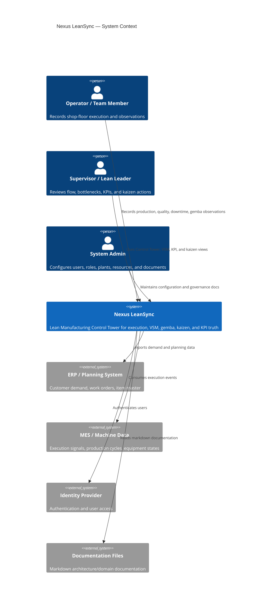
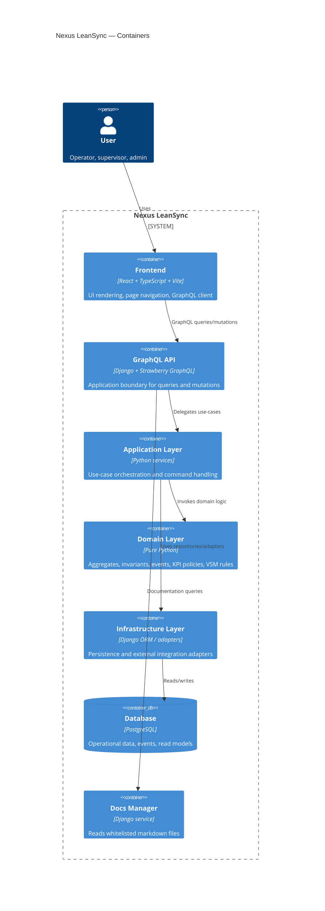
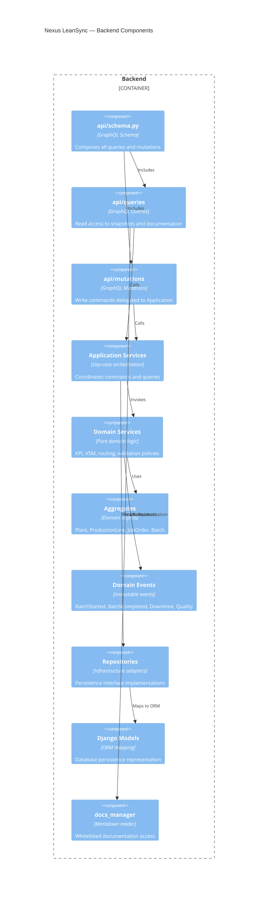
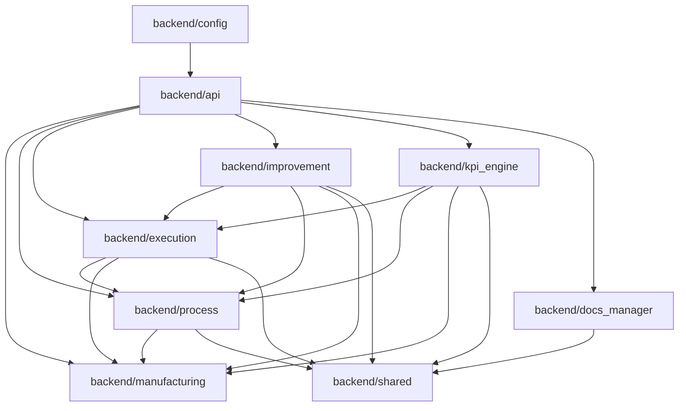

# C4 ARCHITECTURE DIAGRAMS
## Nexus LeanSync — Levels 1–4

---

# Level 1 — System Context

---

# Level 2 — Container Diagram

---

# Level 3 — Component Diagram: Backend

---

# Level 4 — Code-Level Package View

---

# Enforcement Notes

- UI must never own domain logic.
- GraphQL resolvers must delegate to Application services.
- Domain logic must remain framework-agnostic.
- KPI outputs must come from immutable events.
