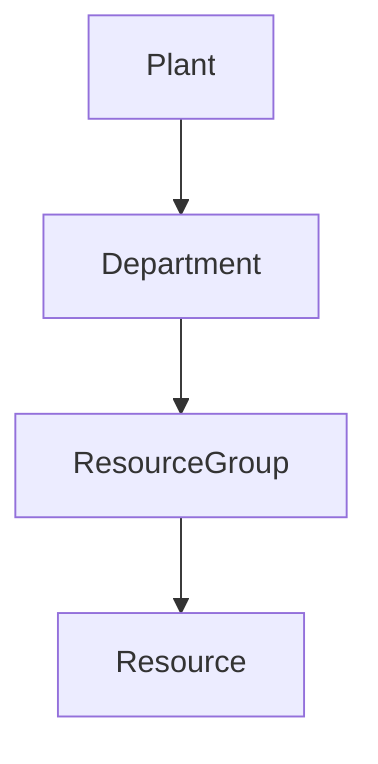
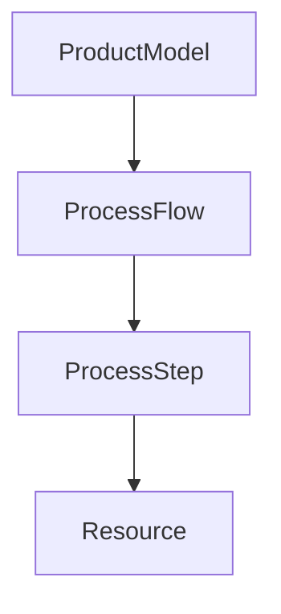
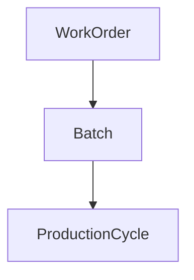
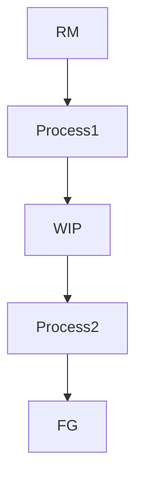

# MERMAID DIAGRAMS

## Physical Structure

```mermaid
graph TD
Plant --> Department --> ResourceGroup --> Resource
```

## Process Structure

```mermaid
graph TD
ProductModel --> ProcessFlow --> ProcessStep --> Resource
```

## Execution Flow

```mermaid
graph TD
WorkOrder --> Batch --> ProductionCycle
```

## VSM

```mermaid
graph TD
RM --> Process1 --> WIP --> Process2 --> FG
```
