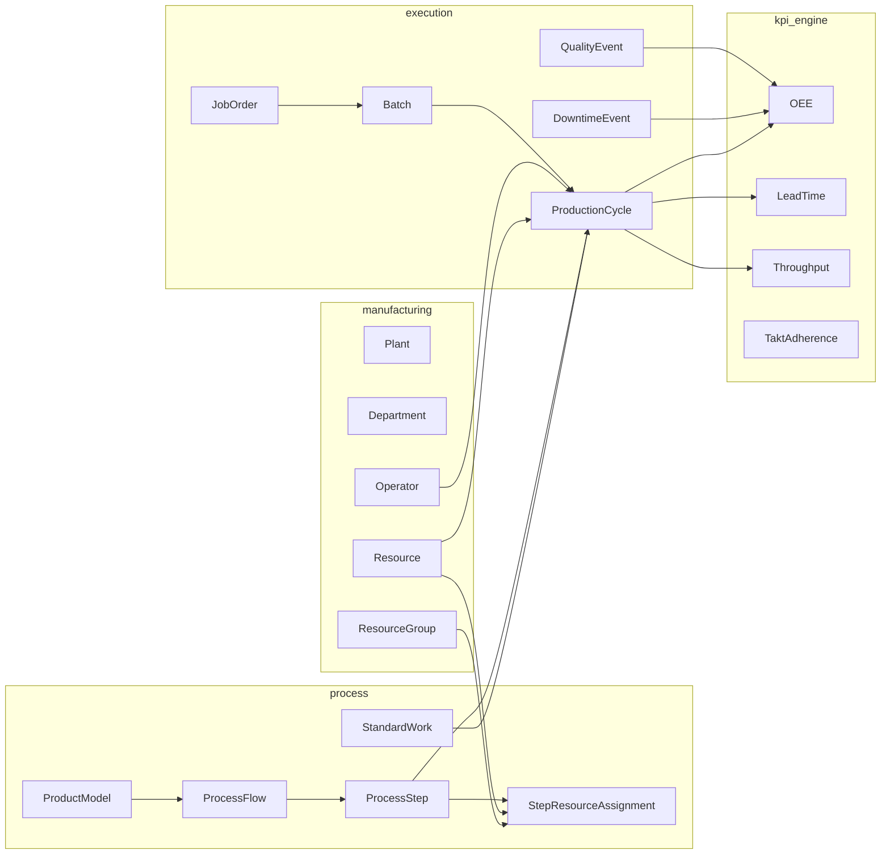

# DOMAIN INTERACTION MAP
## execution → process → manufacturing → kpi_engine

---

# Purpose

This document explains how the main backend domains interact without breaking domain boundaries.

---

# Core Direction

```text
manufacturing → process → execution → kpi_engine
```

Conceptually:

```text
kpi_engine reads execution truth
execution references process routing and manufacturing resources
process references manufacturing capability
manufacturing represents physical factory reality
```

---

# Interaction Map



---

# Manufacturing Domain

Owns physical structure:

```text
Plant → Department → ResourceGroup → Resource
```

It answers:
- Where does work happen?
- What resources exist?
- Which resources are shared?
- What physical capacity exists?

---

# Process Domain

Owns product-specific routing:

```text
ProductModel → ProcessFlow → ProcessStep → StepResourceAssignment
```

It answers:
- How does a product model flow?
- Which steps exist?
- Which resources can perform each step?
- Which routing version is active?

---

# Execution Domain

Owns actual production truth:

```text
JobOrder → Batch → ProductionCycle
```

It answers:
- What was planned?
- What actually happened?
- Which resource was used?
- Which operator worked?
- What downtime or quality events occurred?

---

# KPI Engine

Reads immutable execution truth and derives outputs.

It answers:
- What was Availability?
- What was Performance?
- What was Quality?
- What was OEE?
- What was Lead Time?
- Where is the bottleneck?

---

# Allowed Interaction

```text
execution references process and manufacturing identifiers
kpi_engine reads execution, process, and manufacturing context
process references manufacturing capabilities through assignments
```

# Forbidden Interaction

```text
manufacturing depending on execution
process depending on kpi_engine
execution storing KPI truth
kpi_engine mutating execution history
```

---

# Golden Rule

The KPI engine explains what happened.  
It does not create production truth.
